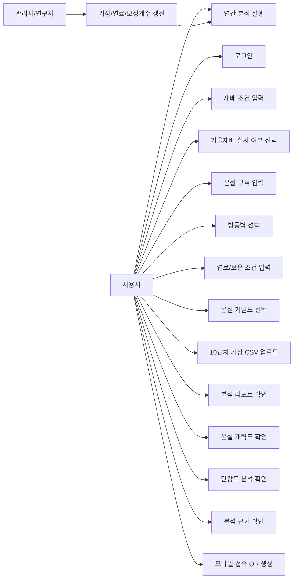
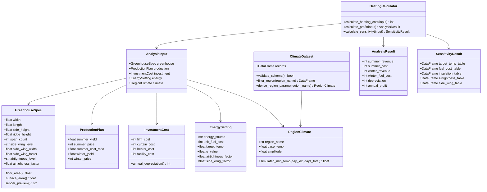
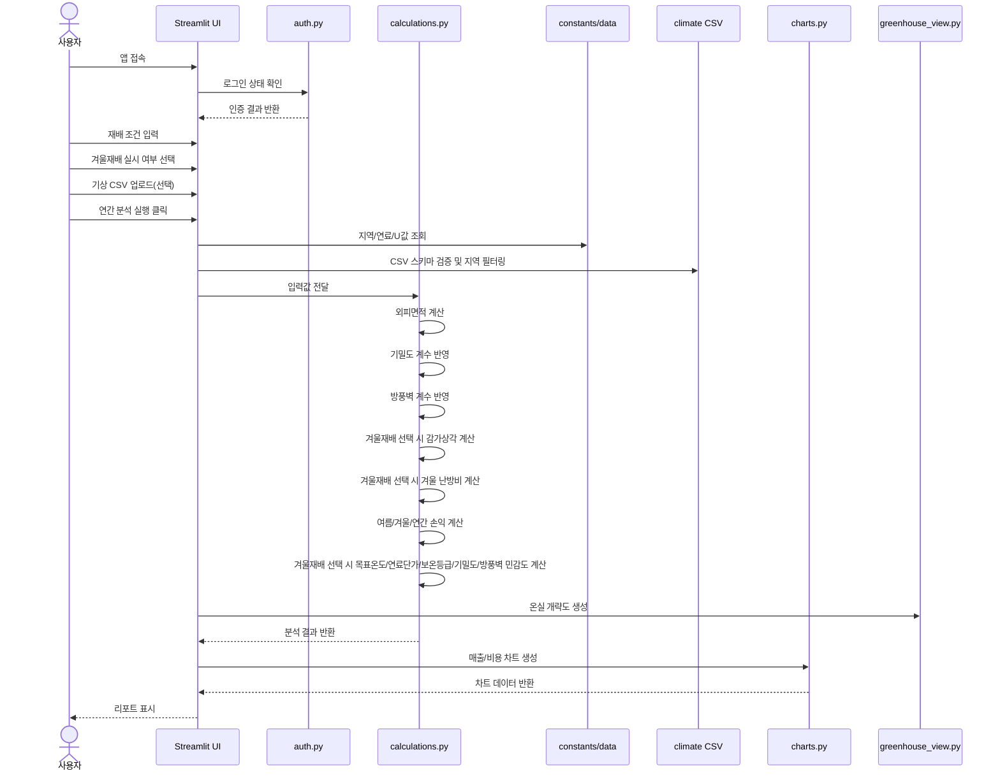
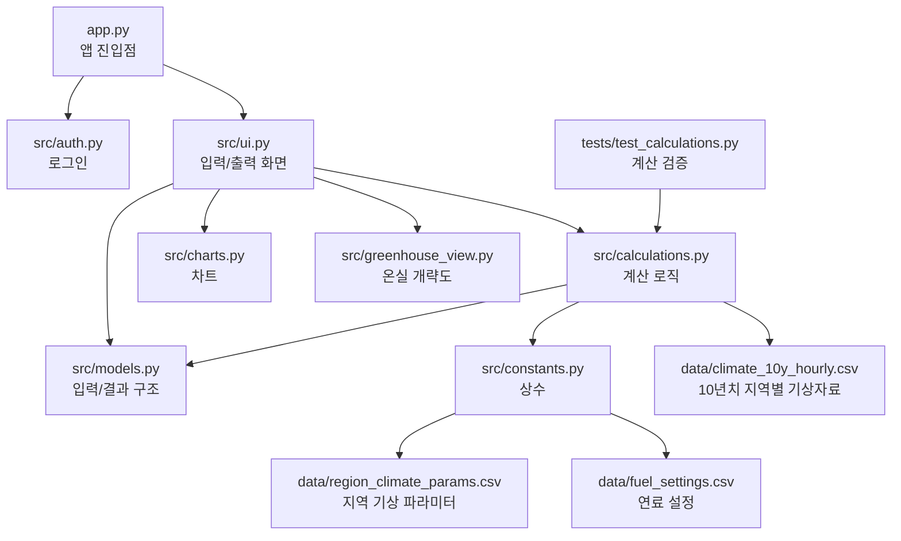
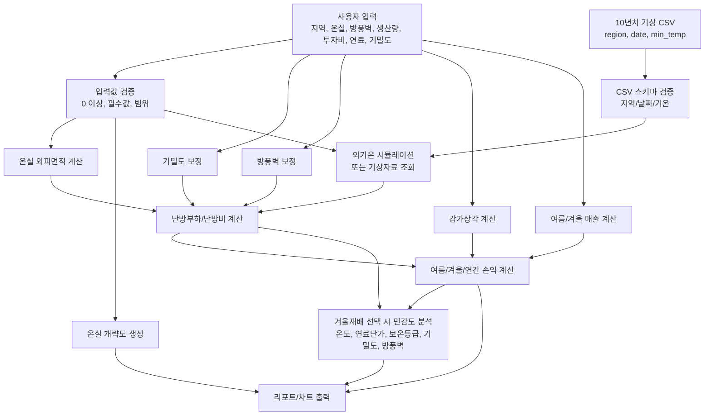

# 무화과 가온재배 의사결정지원 앱 설계도

## 1. 앱 목표

전남 무화과 가온재배 농가가 겨울 작기 도입 여부를 판단할 수 있도록 난방비, 시설비, 매출, 순이익을 예측한다.

핵심 질문은 다음과 같다.

- 겨울 가온재배를 추가하면 연간 순이익이 증가하는가?
- 지역, 온실 규격, 보온 수준, 연료 단가가 난방비에 얼마나 영향을 주는가?
- 농가별 온실 기밀도 차이가 난방비와 순이익에 얼마나 영향을 주는가?
- 방풍벽 유무와 폭이 외부 바람 노출과 난방부하에 얼마나 영향을 주는가?
- 입력한 온실 규격이 개략적인 온실 형태로 이해 가능하게 표시되는가?
- 투자비를 감가상각까지 반영했을 때 겨울 작기가 경제성이 있는가?
- 목표온도, 연료단가, 보온등급 변화에 따라 결과가 얼마나 민감하게 달라지는가?
- 10년치 지역별 기상 CSV 자료를 반영하면 지역별 난방비 추정이 어떻게 달라지는가?

## 2. 현재 앱 구성

현재 앱은 단일 Streamlit 파일인 `app.py`로 구성되어 있다.

- 로그인: `APP_PASSWORD` 기반 접근 제한
- 입력: 지역, 온실 규격, 방풍벽, 여름 생산계획, 겨울재배 실시 여부, 겨울 생산계획, 시설투자비, 에너지 조건, 온실 기밀도
- 선택 입력: 10년치 지역별 기상 CSV 자료
- 계산: 외피면적, 감가상각비, 겨울 난방비, 여름/겨울/연간 순이익, 민감도 분석
- 출력: 여름 재배 성적표, 겨울 재배 투자 성적표, 연간 경영 분석 지표, 온실 개략도, 매출/비용 차트, 민감도 분석, 분석 근거

### 2.1 추가 반영 기능

`기본 입력값`
- 기본 온실 규격은 3연동으로 둔다.
- 1동 기준 폭은 8m, 길이는 42m, 측고는 2.5m, 동고(최고높이)는 4.0m로 둔다.
- 온실면적은 `1동 기준 폭 × 길이 × 연동 수`로 계산한다.

`온실 기밀도 선택`
- 농가별 온실 상태 차이를 반영하기 위해 기밀도 선택값을 둔다.
- 기밀도는 난방부하에 곱해지는 보정계수로 사용한다.
- 현재 기본 계수는 다음과 같다.
  - 매우 우수: 0.90
  - 양호: 1.00
  - 보통: 1.10
  - 취약: 1.25
  - 매우 취약: 1.40
- 기밀도는 난방비와 순이익에는 영향을 주지만, 생산량과 판매단가에는 직접 반영하지 않는다.
- 향후 실제 농가 난방비 기록이 확보되면 기밀도 계수를 실측자료 기반으로 보정한다.

`재배 방식 선택`
- 겨울재배 실시는 기본 선택값으로 둔다.
- 사용자가 겨울재배를 선택 해제하면 여름재배만 분석한다.
- 겨울재배 실시 시 기본 생산계획은 여름 1,219kg, 겨울 635kg으로 둔다.
- 겨울재배 실시 시 기본 판매단가는 여름 6,400원/kg, 겨울 30,000원/kg으로 둔다.
- 겨울재배 미실시, 즉 여름재배만 분석할 때 기본 생산계획은 여름 2,500kg으로 둔다.
- 여름재배만 분석할 때 기본 판매단가는 6,400원/kg으로 둔다.
- 겨울재배 미실시 시 겨울 매출, 난방비, 겨울 투자 상각은 0으로 계산한다.
- 겨울재배 미실시 시 난방비 중심 민감도 분석은 표시하지 않는다.
- 결과 화면에는 여름 재배 성적표를 항상 표시하고, 겨울재배 선택 시 겨울 재배 투자 성적표를 추가로 표시한다.

`면적비례 투자비 및 감가상각`
- 감가상각에 사용하는 기본 투자비는 첨부 엑셀의 300평 기준 자료를 따른다.
- 기준 시트는 `연장재배 투자비(300평)`과 `경영비(10a, 300평)`이다.
- 300평 기준 기본 투자비는 이중비닐 공사 957만원, 보온커튼 공사 840만원, 이중비닐 피복재 24만원, 다겹보온커튼 자재비 248만원으로 둔다.
- 현재 온실 투자비 기본값은 `300평 기준 투자비 × (현재 온실면적 평수 ÷ 300평)`으로 환산한다.
- 감가상각 연수는 이중비닐 공사 10년, 보온커튼 공사 10년, 이중비닐 피복재 3년, 다겹보온커튼 자재비 5년으로 둔다.
- 기본 보온등급은 감가상각 투자비에 다겹보온커튼이 포함된 조건과 일치하도록 `다겹보온커튼 (U=2.0)`으로 둔다.
- 사용자는 자동 환산된 투자비 기본값을 현장 견적에 맞게 수정할 수 있다.

`온실 개략도 표시`
- 사용자가 입력한 온실 폭, 길이, 측고, 동고(최고높이), 연동 수, 방풍벽을 바탕으로 결과 화면에 온실 개략도를 표시한다.
- 별도의 단동/연동 선택 항목은 두지 않고, 연동 수가 1이면 단동, 2 이상이면 연동으로 자동 해석한다.
- 목적은 사용자가 입력값이 실제 온실 형태와 맞는지 직관적으로 확인하게 하는 것이다.
- 무화과 가온재배 온실은 일반적으로 아치형 지붕 비닐하우스 형태가 많으므로, 각 단동 아치가 연동 수만큼 이어진 구조로 표시한다.
- 방풍벽이 있는 경우 온실 양쪽 사이드에서 바닥으로 곡선형으로 내려가는 방풍벽으로 표시해 농가 현실과 입력값을 함께 확인할 수 있게 한다.
- 개략도에는 온실 길이, 측고, 동고(최고높이), 피복/보온 조건을 명확한 라벨로 함께 표시한다.
- 온실 폭은 1동 기준 입력값과 전체 온실 폭을 구분해 표시한다. 전체 온실 폭은 `1동 폭 × 연동 수`로 계산한다.
- 면적 지표는 농가가 이해하기 쉬운 `온실면적` 명칭으로 표시한다.
- 동고(최고높이)는 실제 온실 높이감이 드러나도록 측고 대비 아치 높이 비율을 충분히 크게 표현한다.
- 피복/보온 조건은 현재 선택한 보온 등급과 보온커튼 투자 여부를 요약해 표시한다.
- 모바일 브라우저에서 SVG 일부 요소가 누락되지 않도록, 개략도는 인라인 SVG 직접삽입이 아니라 SVG를 이미지 데이터로 인코딩해 표시한다.
- 장기적으로는 개략도 옆에 외피면적 산출 근거를 함께 표시해 계산 신뢰도를 높인다.

`방풍벽 보정`
- 방풍벽은 기밀도와 별도로 외부 바람 노출을 낮추는 환경 보정값으로 둔다.
- 현장에서는 날개부처럼 표현될 수 있으나, 앱과 설계도에서는 정식 항목명을 `방풍벽`으로 통일한다.
- 보통 온실 폭 기준 양쪽 사이드에 약 1.5m 방풍벽이 있는 경우를 표준으로 둔다.
- 현재 기본 계수는 다음과 같다.
  - 없음: 1.00
  - 한쪽 방풍벽: 0.97
  - 양쪽 방풍벽 표준: 0.94
  - 양쪽 방풍벽+보강: 0.90
- 방풍벽 계수는 난방부하에 곱해지는 보정계수로 사용한다.
- 향후 현장 조사 자료가 확보되면 방풍벽 폭, 길이, 재질, 방향을 세분화한다.

## 3. 재편 시 권장 폴더 구조

```text
fig-heating-decision-app/
  app.py
  requirements.txt
  README.md
  data/
    region_climate_params.csv
    climate_10y_hourly.csv
    fuel_settings.csv
  src/
    auth.py
    constants.py
    models.py
    calculations.py
    charts.py
    ui.py
  tests/
    test_calculations.py
```

## 3.1 현재 Streamlit Cloud 배포 구조

GitHub와 Streamlit Community Cloud에 바로 연결하기 위해 현재 저장소 루트에는 배포용 진입 파일을 둔다.

```text
의사결정모델 구현/
  app.py                         # Streamlit Cloud용 진입 파일
  requirements.txt               # 배포용 의존성
  README.md                      # GitHub/Streamlit 배포 안내
  .gitignore
  .streamlit/
    config.toml
    secrets.toml.example
  01. 최초 파이썬 앱/
    app.py                       # 실제 앱 본문
    APP_BLUEPRINT.md             # 설계도 및 UML
    climate_csv_template.csv
    requirements.txt             # 로컬 실행용 의존성
    run_app.ps1
    run_app.bat
```

- Streamlit Cloud의 Main file path는 루트 `app.py`로 지정한다.
- 루트 `app.py`는 기존 앱 본문인 `01. 최초 파이썬 앱/app.py`를 실행한다.
- 실제 비밀번호는 GitHub에 올리지 않고, Streamlit Cloud의 Secrets에 `APP_PASSWORD`로 등록한다.
- `.streamlit/secrets.toml.example`은 배포자가 참고하는 예시 파일이며 실제 비밀값은 포함하지 않는다.

## 4. 모듈별 역할

`app.py`
- Streamlit 실행 진입점
- 페이지 설정, 로그인 호출, 입력/계산/출력 흐름 연결

`src/auth.py`
- 비밀번호 읽기
- 로그인 화면과 세션 상태 관리

`src/constants.py`
- 지역 목록
- U값
- 연료별 발열량, 효율, 기본 단가
- 농사용 전기는 저압 기준으로 전력량요금 65.9원/kWh, 기본요금 1,150원/kW·월을 기본값으로 둔다.
- 농사용 전기 난방비는 기본 보온등급 `다겹보온커튼 (U=2.0)` 기준에서 300평 실측/기준값 약 620만원에 맞도록 전기요금 현실보정계수 0.90을 적용한다.
- 등유/면세유 계열 기본 단가는 기존 값을 유지한다.
- 겨울 작기 기간

`src/models.py`
- 입력값 묶음용 데이터 구조
- 계산 결과 묶음용 데이터 구조

`src/calculations.py`
- 외피면적 계산
- 기밀도 보정계수 반영
- 방풍벽 보정계수 반영
- 감가상각 계산
- 농사용 전기 선택 시 겨울 기간 최대 시간당 전력수요(kW)를 추정하고, 전력량요금 외에 기본요금 1,150원/kW·월을 겨울 개월 수만큼 추가한다.
- 농사용 전기 계산 결과에는 다겹보온커튼 반영 후 300평 기준 약 620만원 수준이 되도록 보정계수를 곱한다.
- 외기온 시뮬레이션 또는 CSV 기반 기상자료 분석
- 난방비 계산
- 여름/겨울/연간 손익 계산
- 민감도 분석

`src/ui.py`
- 사이드바 입력 폼
- 결과 카드
- 온실 개략도
- 민감도 분석 탭
- 분석 근거 영역

`src/charts.py`
- 매출 차트
- 비용 차트
- 민감도 분석 차트

`src/greenhouse_view.py`
- 입력 규격 기반 온실 개략도 생성
- 각 단동 아치가 연결된 연동 지붕, 1동 폭, 전체 온실 폭, 길이, 측고, 동고(최고높이), 연동 수, 곡선형 방풍벽, 피복/보온 조건을 시각적으로 표시
- Streamlit 화면에는 인코딩된 SVG 이미지로 렌더링해 데스크톱과 모바일 표시 차이를 줄인다.

`data/climate_10y_hourly.csv`
- 10년치 지역별 기상자료 원본 또는 전처리 자료
- 최소 컬럼: `region`, `date`, `min_temp`
- 고도화 시 권장 컬럼: `region`, `datetime`, `temp`, `min_temp`, `max_temp`, `source_station`

## 5. 알고리즘 고도화 방향

1. 현재 버전
- 지역별 `base`, `amp`를 이용한 간이 최저기온 곡선
- 14시간 가온 고정 가정
- 아치형 지붕 기반 외피면적 근사
- 난방비는 `외피면적 × U값 × 온도차 × 시간 × 기밀도 계수 × 방풍벽 계수` 구조

2. 2단계
- 10년치 지역별 CSV 기온 자료 반영
- 지역별, 월별, 시간대별 평균 외기온 사용
- 평년, 한파, 온난 시나리오 분리

3. 3단계
- 실제 농가 난방비 기록으로 보정계수 추정
- 연료별 단가 변동 시나리오
- 목표온도별 수량/품질 변화 반영

4. 4단계
- 추천 알고리즘 추가
- 예: 목표 순이익을 만족하는 최소 보온 수준, 적정 목표온도, 손익분기 단가 제안

## 6. UML 설계

UML은 앱을 직접 고치거나 기능을 확장할 때 기준 역할을 한다. 아래 다이어그램은 Mermaid 문법으로 작성되어 GitHub Markdown에서 바로 확인하거나 수정할 수 있다.

### 6.1 유스케이스 다이어그램

사용자 관점에서 앱이 제공해야 하는 기능을 정리한다.



### 6.2 클래스 다이어그램

향후 `src/models.py`와 `src/calculations.py`로 분리할 때 사용할 데이터 구조와 계산 객체의 관계를 나타낸다.



### 6.3 시퀀스 다이어그램

사용자가 분석 버튼을 누른 뒤 앱 내부에서 계산과 출력이 진행되는 순서를 표현한다.



### 6.4 컴포넌트 다이어그램

재편 후 파일들이 어떤 책임을 나누고 연결되는지 표현한다.



### 6.5 데이터 흐름 다이어그램

입력 데이터가 계산 결과로 바뀌는 흐름을 요약한다.



## 7. 다음 구현 우선순위

1. `app.py`를 `src/` 모듈 구조로 분리
2. 계산 함수 단위 테스트 추가
3. 지역 기상 파라미터를 CSV로 분리
4. 난방 모델을 `간이 14시간`과 `시간별 24시간` 두 방식으로 선택 가능하게 확장
5. 기밀도 계수를 실제 농가 실측 난방비로 보정
6. 방풍벽 계수를 현장 조건에 맞게 보정
7. 온실 개략도를 실제 사진/도면 기준의 연동 아치 구조로 더 정교화
8. 10년치 기상 CSV의 컬럼 규칙 확정
9. 업로드 CSV에서 지역별 월별/시간대별 계수 자동 산출
10. 민감도 분석을 손익분기점 추천 기능으로 확장
11. 배포용 README 작성 및 GitHub/Streamlit Cloud 배포 설정 유지

## 8. 검증 기준

- 같은 입력이면 항상 같은 결과가 나와야 한다.
- 생산량, 단가, 투자비, 연료 단가가 0이어도 앱이 멈추지 않아야 한다.
- `st.set_page_config()`는 앱에서 한 번만 호출되어야 한다.
- 계산 로직은 Streamlit UI 없이도 테스트 가능해야 한다.
- 기상자료 출처와 가정값은 화면에 명확히 표시되어야 한다.
- CSV 업로드 시 필수 컬럼 누락, 날짜 오류, 선택 지역 미존재 상황을 안내해야 한다.
- 민감도 분석은 기준 입력값을 바꾸지 않고 별도 시나리오로 계산해야 한다.
- 겨울재배 미실시 선택 시 여름 재배 성적표와 여름 기준 연간 소득만 계산되어야 한다.
- 겨울재배 미실시 선택 시 겨울 난방비, 겨울 매출, 겨울 투자 상각은 0이어야 한다.
- 겨울재배 미실시 선택 시 난방비 중심 민감도 분석은 표시하지 않는다.
- 기밀도 계수는 난방부하 계산에만 반영하고 매출 계산에는 직접 반영하지 않는다.
- 방풍벽 계수는 난방부하 계산에만 반영하고 매출 계산에는 직접 반영하지 않는다.
- 온실 개략도는 각 단동 아치가 연결된 연동 구조를 기본으로 하며, 사용자가 입력한 1동 폭, 계산된 전체 온실 폭, 길이, 측고, 동고(최고높이), 연동 수, 곡선형 방풍벽, 피복/보온 조건을 표시해야 한다.
