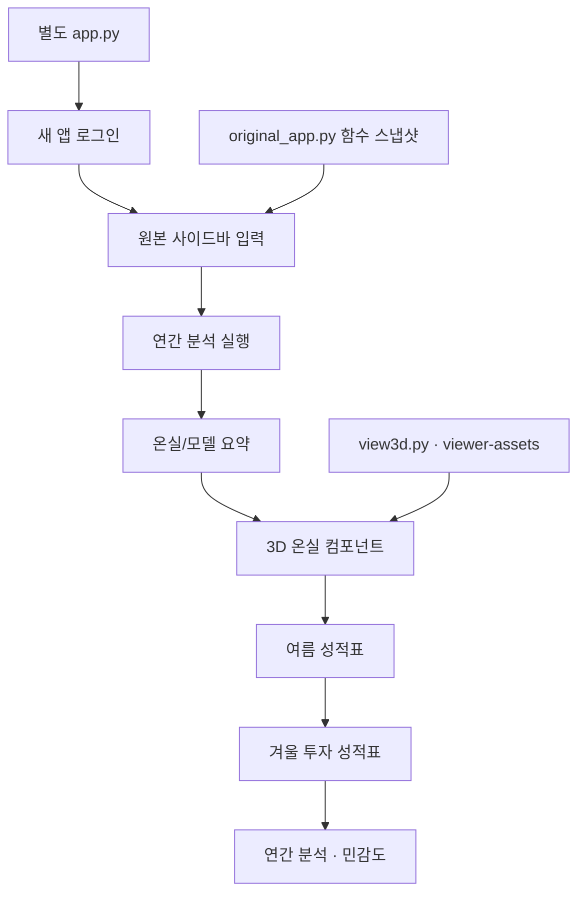

# 무화과 시설재배 경영의사결정지원시스템

원본을 보존한 별도 Python·Streamlit 앱입니다. 루트 app.py와 01. 최초 파이썬 앱 및 기존 앱의 배포 설정은 변경하지 않습니다.

원본 사이드바, 온실/모델 요약, 여름·겨울 성적표, 연간 분석과 민감도를 유지합니다. 온실 요약 아래, 여름 성적표 위에 3D 온실을 표시하며 2D 개략도는 제외합니다. 양액기 쪽이 정면이고 보온커튼은 열린 상태입니다. 금액은 정수 만원으로 표시하고 계산 정밀도는 유지합니다. 농가유형·전환목적, 추가 투자·운영조건, 준비확인·근거 및 연결된 추가 분석은 표시하지 않습니다.

## 별도 배포

Streamlit Community Cloud에서 기존 앱을 편집하지 말고 새 앱을 만드세요.

- Repository: kuk-jong/fig-heating-decision-app
- Branch: main
- Main file path: streamlit-enhanced/app.py
- Python: 3.12
- 로그인 기본값은 요청한 새 앱 비밀번호입니다. 새 앱 Secrets의 APP_PASSWORD로 재설정할 수 있습니다. 원본 Secrets는 공유하지 않습니다.
- 새 앱의 실제 공개 URL을 Secrets의 APP_URL에 설정하면 QR코드가 새 앱을 가리킵니다. 설정 전에는 원본 주소를 대신 표시하지 않습니다.

로컬 실행: pip install -r requirements.txt 후 streamlit run app.py.

## 구조

app.py는 별도 화면·로그인 설정, original_app.py는 원본 함수 스냅샷, view3d.py와 viewer-assets/는 3D 표시를 담당합니다. enhancement.py는 실행하지 않는 이전 모듈입니다.

겨울 계산 기간은 원본 11~2월입니다. 기본 수량·가격과 모의 기상은 현장 근거로 확인해야 합니다. 3D 설비·식재는 개략 예시로 투자·수량 계산과 독립입니다. 3D에는 WebGL과 Three.js CDN 접속이 필요합니다.
