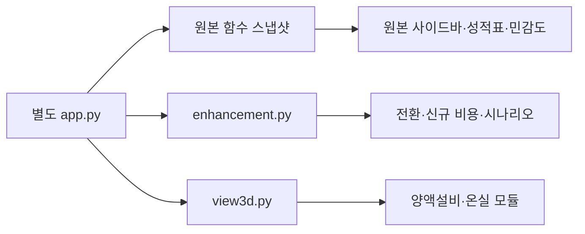

# Python·Streamlit 원본 구성 보완판 v0.1

기준 원본: kuk-jong/fig-heating-decision-app의 `01. 최초 파이썬 앱/app.py`.

사이드바 입력 → 연간 분석 실행 → 온실 요약·여름 성적표·겨울 성적표·연간 경영분석·민감도라는 원본 흐름을 유지합니다. 별도 진입점 app.py에서 원본 함수 스냅샷을 불러오며 원본 저장소의 루트 진입점과 기존 본문은 수정하지 않습니다.

추가 기능: 기존/신규 농가, 전환 목적 기록, 재사용 투자 제외, 추가 투자·운영비·자가노동·차입 조건, 기존 실적 대비 추가 영업현금, 동시 시나리오, 준비 확인·메모·CSV. 마음에 드신 3D 온실·양액설비는 입력 치수에 연결한 보조 시각화로 포함합니다.

실행: `pip install -r requirements.txt`, `streamlit run app.py --server.port 8502`.

로그인은 원본의 APP_PASSWORD 설정을 사용합니다. Streamlit Cloud에서는 이 별도 폴더 app.py를 새 앱의 진입점으로 지정하고 새 앱 Secrets에 APP_PASSWORD를 설정하세요. 기존 앱의 배포 진입점은 바꾸지 않습니다. Python 앱은 GitHub Pages로 실행할 수 없습니다.

상단 성적표는 원본 모델이고, 아래 보완 분석은 추가 조건을 적용한 별도 결과입니다. 겨울 기간(11~2월), 14시간 가온, 모의 기상·CSV 파라미터화와 원본 생산·단가 기본값은 유지했습니다. 수확기 연장·조기 출하는 목적 기록만 하며 해당 기간의 난방·생산을 자동 계산하지 않습니다. 보완판도 초기 정착률·월별 부족액·할인·세금·보조금·시설 재투자를 모델링하지 않습니다.

## 구조

`app.py` 화면 연결 / `original_app.py` 기준 원본 스냅샷 / `enhancement.py` 추가 입력과 계산·출력 / `view3d.py` Streamlit HTML 컴포넌트 생성 / `viewer-assets/` 3D 모듈. 3D는 CDN 인터넷·WebGL이 필요하며 실패해도 다른 계산은 유지됩니다.

검증: Streamlit AppTest의 분석 실행과 성적표·추가 지표, 독립 수치 예제의 비용·이자·원금 계산. 3D는 실제 브라우저에서 별도 확인합니다. 원본 로그인 설정을 그대로 유지하므로 새 앱 배포 시 비밀번호를 별도로 설정해야 합니다.
